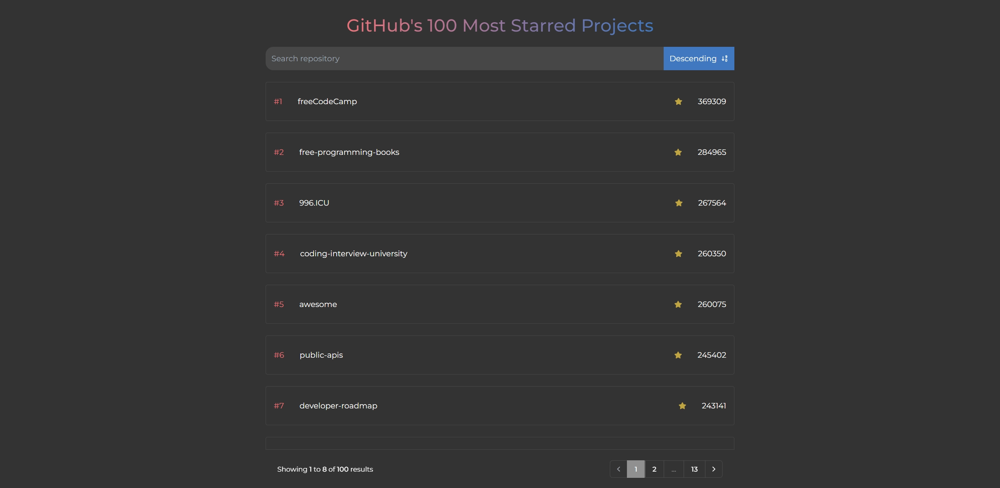

# Front-end-challenge - GitHub Top Repositories

## To run the project locally

1. Clone the repository to your local machine.
2. Install the dependencies by running `npm install`.
3. Start the development server by running `npm run dev`.
4. Ctrl + left click the link in terminal to open the project in the browser.

### Challenge overview

This challenge involves working with the GitHub API to create a Single-Page
Application (SPA) by using HTML, CSS and Javascript, that reads specific parts
of the API and displays the data in an organized way.

Which data to get from the API has been up to me, and I decided to work with the top 100 most starred repositories.

### Screenshot

### links

- Solution URL: [GitHub's 100 Most Starred Projects](https://chimerical-fudge-a70f7b.netlify.app/)

### Built with

## Social

- Frontend Mentor - [@EmilBacklund](https://www.frontendmentor.io/profile/EmilBacklund)
- Twitter - [@backiz](https://twitter.com/backiz)
- GitHub - [@EmilBacklund](https://github.com/EmilBacklund)
- Linkedin - [Emil Backlund](https://www.linkedin.com/in/emil-backlund-55b10021a/)
- Discord - [Rullstolsbandit](https://discordapp.com/users/311586488720818187)
- Portfolio - [backlundstudio](https://backlundstudio.com/)
